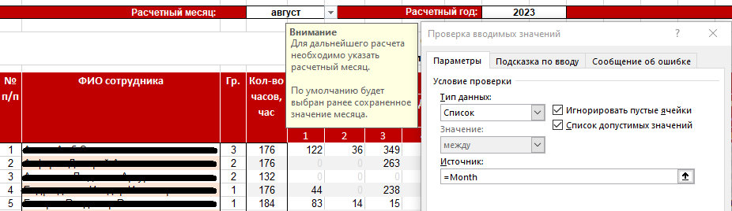

#  Работа с данными Excel

### "Учет и анализ результатов работ"

Приложение сбора и оперативного анализа результатов работы сотрудников call-центра компании-системного интегратора.

В расчетах учитываются 18-ть показателей работ, прогнозирование выполнения плановых показателей за отчетный период
по каждому виду работ. Базой для приложения является инструментарий "MS Excel".

Внедрение приложения улучшило качество ежедневного контроля результатов работы сотрудников call-центра, позволило оперативно и 
обосновано перераспределять работы между ними.

По итогам внедрения штат call-центра был сокращен на 20%, соответственно
**сокращены ежемесячные расходы** на содержание *лишнего* персонала.

### 1. Извлечение данных
**1.1. Использование различных источников данных:**
- книга Excel;
- CSV файл;
- таблица Google;
- ODBC.

*Иллюстрация 1.1. Извлечение данных из внешнего источника*

### 2. Рассчеты

**2.1. Использование сложных функции:**

> =ЕСЛИ(D29<=0;0;(E29*Служебный!$C$26+НагрузкаПоДнямПоАлфавиту!F29*Служебный!$C$27+НагрузкаПоДнямПоАлфавиту!G29*Служебный!$C$28+НагрузкаПоДнямПоАлфавиту!H29*Служебный!$C$29+НагрузкаПоДнямПоАлфавиту!I29*Служебный!$C$30+НагрузкаПоДнямПоАлфавиту!J29*Служебный!$C$31+НагрузкаПоДнямПоАлфавиту!K29*Служебный!$C$32+НагрузкаПоДнямПоАлфавиту!L29*Служебный!$C$33+НагрузкаПоДнямПоАлфавиту!M29*Служебный!$C$34+НагрузкаПоДнямПоАлфавиту!N29*Служебный!$C$35+НагрузкаПоДнямПоАлфавиту!O29*Служебный!$C$36+НагрузкаПоДнямПоАлфавиту!P29*Служебный!$C$37+НагрузкаПоДнямПоАлфавиту!Q29*Служебный!$C$38)/60/НагрузкаПоДнямПоАлфавиту!D29*100)

*Иллюстрация 2.1. Работа с формулами*

### 3. Анализ и обработка данных

**3.1. Ограничения на вводимые данные:**
- формирование списка возможных вариантов ввода данных;
- использование для ввода специальных элементов типа список.

*Иллюстрация 3.1. Формирование списка возможных значений ввода*

**3.2. Фильтрация данных:**
- по значению;
- по цвету.

*Иллюстрация 3.2. Фильтрация данных по значению (значение Гр. = 1)*

**3.3. Формирование сводных таблиц:**
- использование функций;
- условное форматирование.

*Иллюстрация 3.3. Сводная таблица по видам обращений*

**3.4. Другие операции с данными:**
- группировка;
- консолидация;
- обработка дубликатов.

*Иллюстрация 3.4. Группировка данных, обработка дубликатов*

### 4. Визуализация данных

**4.1. Условное форматирование значений:**
- красный - меньше 50%;
- желтый - от 50% до 95%;
- зеленый - больше 95%.

*Иллюстрация 4.1. Условное форматирование поля "Нагрузка" по значению*

**4.2. Построение диаграмм:**
- формирование списка возможных вариантов ввода данных;
- использование для ввода специальных элементов типа "список".

*Иллюстрация 4.2. Диаграмма "Нагрузка на сотрудника"*

___       
***MS Excel v. 2019***